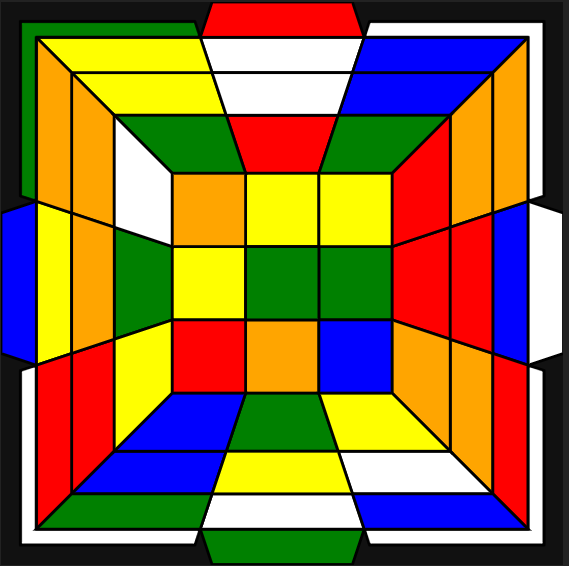

# BLD Topological Cube Visualization (Prototype)

## 🧠 Overview

This project proposes a new 2D visualization method for Rubik’s Cube, specifically designed for Blindfolded Solving (BLD).

Unlike traditional net or 3D-like projections, this system focuses on preserving **full piece adjacency relationships** (edges and corners) in a single 2D layout.

The goal is to improve memorization and tracing efficiency in BLD methods such as M2 and 3-style.

---

## 🎯 Core Concept

The key idea is a **topology-preserving 2D transformation** of the Rubik’s Cube:

- Front face (F) is placed at the center
- Surrounding faces (U, R, D, L) are arranged around F
- These faces are geometrically distorted (trapezoidal / perspective warp)
  to preserve adjacency relationships
- The back face (B) is represented as an outer layer showing only edge/corner stickers
- Center pieces of B are omitted for clarity

This ensures that **every cubie remains visually connected to all adjacent faces**.

---

## 📐 Design Goals

- Preserve full adjacency relationships between all cubies
- Maintain a single unified 2D view (no split front/back panels)
- Improve mental tracing for BLD memorization systems
- Reduce cognitive load compared to traditional net layouts
- Enable interactive highlighting of piece cycles (future extension)

---

## 🧩 Visualization Structure

````
    U
 /     \
L —   F   — R
\     /
D

Outer ring:
B face edge & corner stickers only

````

*(This is a conceptual representation; actual implementation uses geometric transformation.)*

---

## Visualization Example
For "B D' F U2 B' L2 F R' U2 B2 D2 R2 U' B' R F2 U R' B R", the unfolded diagram will be displayed as:


## 🧪 Intended Use Case

- Blindfolded Rubik’s Cube solving (3BLD / MBLD)
- M2 method tracing visualization
- 3-style memo training support
- Educational tools for cube topology understanding

---

## ⚙️ Implementation Notes

Recommended technical approach:

- SVG-based rendering (preferred)
- Each sticker represented as a polygon
- Each cubie identified by piece ID (not position only)
- Face transformations handled via coordinate mapping
- Optional: interactive highlighting per cubie cycle

Example data model:

```javascript
{
  pieceId: "UBL",
  type: "edge", // or "corner"
  stickers: [
    { face: "U", color: "white" },
    { face: "B", color: "blue" }
  ],
  geometry: [[x1,y1], [x2,y2], [x3,y3], [x4,y4]]
}
````

---

## 🚧 Status

* Concept design: ✔ Complete
* Prototype implementation: 🚧 In progress
* Optimization for BLD workflow: 🚧 In progress

---

## 💡 Future Improvements

* Animated cube rotations
* Highlighting of buffer positions
* Cycle tracing visualization for M2 / 3-style
* Training mode for memo practice
* Custom scramble input support

---

## 📌 Motivation

Traditional cube representations are not optimized for blindfolded solving, where **relationship memory (not spatial position)** is critical.

This project explores a visualization method that prioritizes:

> "Connectivity over geometry"

---

## 📜 License

TBD (feel free to fork and experiment)

---

## 👤 Author

Anonymous / Handle: norha-aurum
Concept created: 2026-05-06